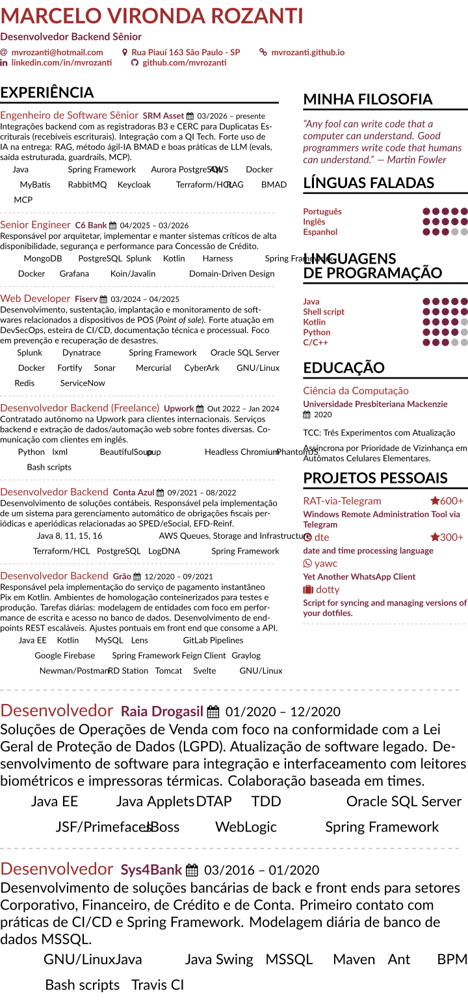

# CV — Marcelo Vironda Rozanti

Six tailored CVs in one repo: **2 languages (en, ptbr) × 3 framings (original, human, bot)**.

|          | original (hand-authored) | human (altacv, impact) | bot (ATS plain-text) |
|----------|--------------------------|------------------------|----------------------|
| **en**   | `en/original`            | `en/human`             | `en/bot`             |
| **ptbr** | `ptbr/original`          | `ptbr/human`           | `ptbr/bot`           |

## Build

    make            # all six -> build/<id>.pdf
    make en-human   # just one
    make check      # build + assert no orphan trailing pages
    make preview    # regenerate preview.png

See `CLAUDE.md` for editing rules (source of truth, no-info-loss, no-orphan-pages, parity, tailoring).
